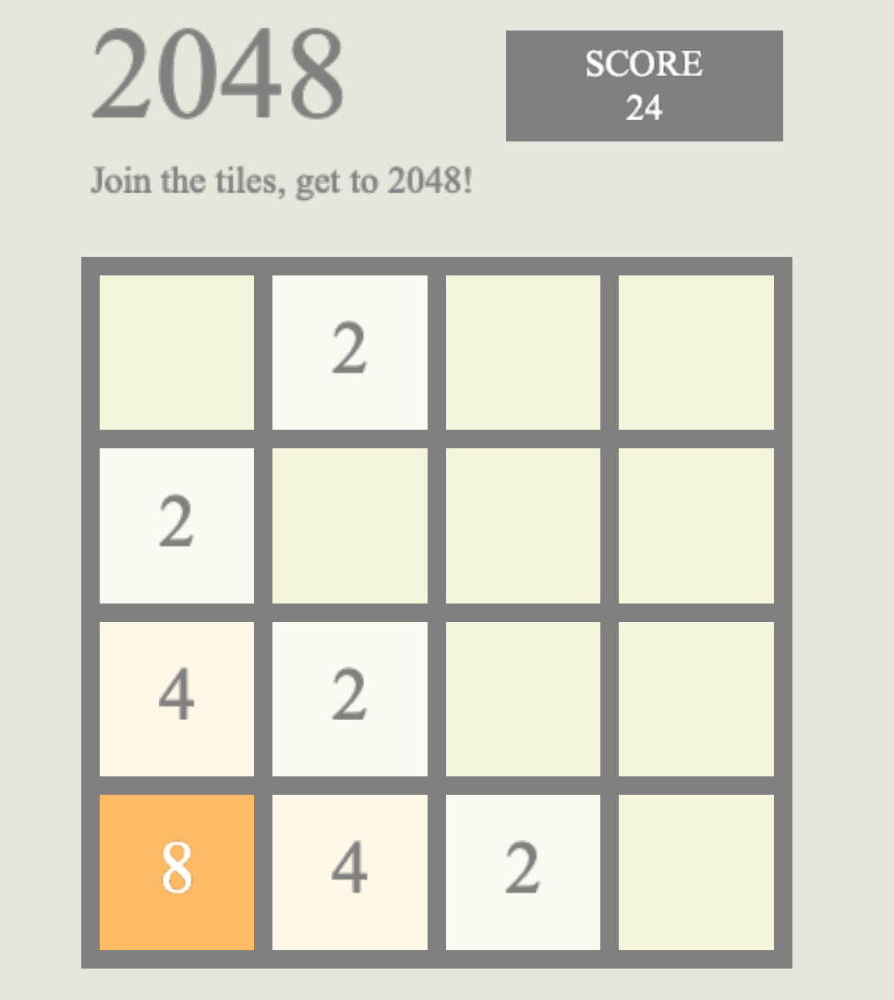

# 2048
2048 is a single player sliding puzzle game with the overall aim of sliding and merging 
number tiles to reach 2048.

#### **Dependencies**
* [Cinder][1]
* [Catch2][2]

[1]: https://libcinder.org/
[2]: https://github.com/catchorg/Catch2

### Game

##### How to Play
Numbered tiles will continue to appear as you move them. Use the arrow keys to move the tiles
in the corresponding directions. Two tiles with the same number will merge into one tile with the
sum of their numbers when they touch (for example, moving a tile numbered 2 up into another tile numbered
2 will result in one tile numbered 4). You lose when the board is filled with tiles and no more merges 
or movements are possible. Continue moving and adding the tiles up to reach 2048!

##### Controls

|   Key   |       Action       |
| ------- |:------------------:|
| `Left Arrow` | Slide all tiles to the left |
| `Right Arrow` | Slide all tiles to the right |
| `Up Arrow` | Slide all tiles to the up |
| `Down Arrow` | Slide all tiles to the down |

##### Installing
Make sure you have downloaded [Cinder][3] and cloned the project inside
the Cinder folder, then load the CMake file. Run the main file or the 2048-game
configuration to start the game.

[3]: https://libcinder.org/download